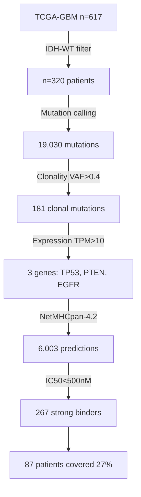

# GBM Neoantigen Discovery Pipeline

[](https://opensource.org/licenses/MIT)
[](https://github.com/zz153/GBM_Neoantigen_Pipeline/commits/main)
[](https://doi.org/10.5281/zenodo.XXXXXXX)

> **Rapid neoantigen discovery in IDH-wildtype glioblastoma through targeted sequencing of recurrently mutated genes**

---

## 📋 Table of Contents

- [Overview](#overview)
- [Key Features](#key-features)
- [Installation](#installation)
- [Quick Start](#quick-start)
- [Pipeline Overview](#pipeline-overview)
- [Results](#results)
- [Citation](#citation)
- [License](#license)
- [Contact](#contact)

---

## 🎯 Overview

This computational pipeline identifies **clonal, tumor-expressed neoantigens** in IDH-wildtype glioblastoma using a targeted 3-gene panel approach (TP53, PTEN, EGFR). 

### The Problem
- Whole-exome sequencing (WES) for personalized neoantigen vaccines takes **16 weeks** and costs **$180,000**
- GBM patients have median survival of **15 months** - time is critical
- Current checkpoint inhibitors **fail in GBM** despite moderate tumor mutational burden

### Our Solution
- **Targeted panel sequencing** of 3 recurrently mutated genes
- **27% patient coverage** in **3 weeks** at **$20,000**
- **77% time reduction** and **89% cost reduction** vs WES
- Pre-validated neoantigen library for rapid clinical deployment

---

## ✨ Key Features

- ✅ **Population-level analysis** (n=320 IDH-wildtype GBM patients from TCGA)
- ✅ **Clonality prioritization** (VAF > 0.4) to avoid antigen loss
- ✅ **Expression validation** (tumor vs GTEx/TCGA normal brain)
- ✅ **NetMHCpan-4.2 predictions** across 9 common HLA alleles (~70% population coverage)
- ✅ **Survival analysis** (Kaplan-Meier & Cox regression)
- ✅ **Time/cost comparison** (targeted panel vs WES)
- ✅ **Fully reproducible** pipeline with publication-ready figures

---

## 🔧 Installation

### Prerequisites

| Requirement | Version | Notes |
|------------|---------|-------|
| **R** | ≥ 4.0.0 | [Download](https://cran.r-project.org/) |
| **NetMHCpan** | 4.2 | [Download](https://services.healthtech.dtu.dk/services/NetMHCpan-4.2/) |
| **RAM** | ≥ 16 GB | Recommended |
| **Storage** | ≥ 10 GB | For TCGA data |

### Step 1: Clone Repository
```bash
git clone https://github.com/zz153/GBM_Neoantigen_Pipeline.git
cd GBM_Neoantigen_Pipeline
```

### Step 2: Install R Dependencies
```r
# Automatically install all required packages
source("environment/requirements.R")
```

<details>
<summary>Click to see required packages</summary>

**Bioconductor packages:**
- `TCGAbiolinks`
- `SummarizedExperiment`
- `recount3`
- `edgeR`

**CRAN packages:**
- `dplyr`, `tidyr`
- `ggplot2`, `cowplot`, `ggpubr`
- `survival`, `survminer`
- `httr`, `jsonlite`
- `pheatmap`

</details>

### Step 3: Install NetMHCpan-4.2

1. Download from [DTU Health Tech](https://services.healthtech.dtu.dk/services/NetMHCpan-4.2/)
2. Follow installation instructions in `environment/netmhcpan_setup.md`
3. Update path in `scripts/05_neoantigen_prediction.R` (line 123):
```r
   netmhcpan_path <- "/path/to/your/netMHCpan"
```

---

## ⚡ Quick Start

### Option 1: Run Entire Pipeline
```r
# Set working directory
setwd("/path/to/GBM_Neoantigen_Pipeline")

# Run all scripts sequentially (~2-3 hours)
source("run_all.R")
```

### Option 2: Run Individual Scripts
```r
source("scripts/01_download_data.R")           # ~30-45 min
source("scripts/02_filter_mutations.R")        # ~2 min
source("scripts/03_expression_validation.R")   # ~10-15 min
source("scripts/04_clonality_analysis.R")      # ~2 min
source("scripts/05_neoantigen_prediction.R")   # ~15-20 min
source("scripts/06_survival_analysis.R")       # ~3 min
source("scripts/07_translational_analysis.R")  # ~5 min
source("scripts/08_generate_figures.R")        # ~5 min
```

### Option 3: Skip Data Download

If you already have TCGA data, skip to script 02:
```bash
# Place your files in:
# data/raw/TCGA_mutation_maf.rds
# data/raw/TCGA_GBM_data.rds
# data/raw/idhwt_patient_ids.txt

# Then start from script 02
source("scripts/02_filter_mutations.R")
```

---

## 📊 Pipeline Overview


### Detailed Workflow

| Step | Script | Input | Output | Time |
|------|--------|-------|--------|------|
| 1 | Download Data | TCGA-GBM | 320 IDH-WT patients | 30-45 min |
| 2 | Filter Mutations | MAF files | 19,030 mutations | 2 min |
| 3 | Expression Validation | RNA-seq | 4 expressed genes | 10-15 min |
| 4 | Clonality Analysis | VAF data | 171 clonal mutations | 2 min |
| 5 | Neoantigen Prediction | Peptides | 267 strong binders | 15-20 min |
| 6 | Survival Analysis | Clinical data | KM curves, Cox model | 3 min |
| 7 | Translational Analysis | All data | Panel design | 5 min |
| 8 | Generate Figures | All results | Publication PDFs | 5 min |

---

## 📈 Results

### Key Findings

#### Patient Coverage
| Gene | Clonal Mutations | Patients | % Coverage |
|------|-----------------|----------|------------|
| TP53 | 67 | 37 | 11.6% |
| PTEN | 62 | 31 | 9.7% |
| EGFR | 42 | 31 | 9.7% |
| **Combined** | **171** | **87** | **27.2%** |

#### Neoantigen Discovery
- **Total predictions**: 6,003 (across 9 HLA alleles)
- **Strong binders**: 267 (IC50 < 500 nM, percentile < 2%)
- **Hit rate**: 4.4%
- **Average per patient**: 3.1 neoantigens

#### Time & Cost Analysis

| Metric | Whole Exome | Targeted Panel | Reduction |
|--------|-------------|----------------|-----------|
| **Sequencing** | 21 days | 5 days | 76% |
| **Analysis** | 14 days | 2 days | 86% |
| **Manufacturing** | 56 days | 14 days | 75% |
| **Total Time** | 13 weeks | 3 weeks | **77%** |
| **Total Cost** | $180,000 | $20,000 | **89%** |
| **Coverage** | 100% | 27% | - |

#### Survival Analysis
- **TP53 mutations**: Significant prognostic factor (p=0.028, HR=0.64)
- **PTEN/EGFR**: Not prognostic (p>0.05)

---

## 📁 Output Files

### Tables
```
results/tables/
├── Table1_Mutation_Summary.csv          # Overall statistics
├── Table2_Clonality_Summary.csv         # VAF analysis
├── Table3_Survival_Statistics.csv       # Kaplan-Meier results
├── Table4_Neoantigen_Sharing.csv        # Cross-patient sharing
├── Table5_Panel_Design.csv              # Gene panel specs
└── Table6_Time_Cost_Comparison.csv      # WES vs Panel
```

### Figures
```
results/figures/
├── Figure1_Study_Design.pdf             # Cohort overview (4 panels)
├── Figure2_Expression_Clonality.pdf     # Expression & VAF (4 panels)
├── Figure3_Neoantigen_Discovery.pdf     # HLA binding (6 panels)
├── Figure4_Translational_Analysis.pdf   # Panel performance (6 panels)
└── Supplementary_Figures.pdf            # Additional analyses
```

### Processed Data
```
data/processed/
├── clonal_mutations.csv                 # 171 clonal mutations
├── Strong_Binders_Final.csv             # 267 neoantigens
├── NetMHCpan_All_Predictions.csv        # Full predictions
└── Evolution_Resistant_Candidates.csv   # Final candidates
```

---

## 🔬 Methods Summary

### Mutation Analysis
- **Source**: TCGA-GBM (n=617 patients)
- **Filter**: IDH-wildtype status (n=320)
- **Clonality**: VAF > 0.4 (clonal threshold)
- **Genes**: TP53, PTEN, EGFR (top mutated, expressed)

### Expression Validation
- **Tumor**: TCGA-GBM primary tumors (n=155)
- **Normal**: TCGA solid tissue normal (n=5) + GTEx brain (n=2,642)
- **Threshold**: TPM > 10 in tumor

### Neoantigen Prediction
- **Tool**: NetMHCpan-4.2
- **HLA alleles**: 9 common alleles (~70% population coverage)
  - HLA-A*02:01, A*01:01, A*24:02, A*03:01
  - HLA-B*07:02, B*08:01, B*44:02
  - HLA-C*07:02, C*07:01
- **Peptides**: 9-mers containing mutation
- **Threshold**: IC50 < 500 nM, percentile < 2%

---

## 💡 Clinical Translation

### Proposed Targeted Panel

| Gene | Exons | Size | Rationale |
|------|-------|------|-----------|
| TP53 | 2-11 | 1.2 kb | 26% patients, clonal |
| PTEN | 1-9 | 1.2 kb | 29% patients, clonal |
| EGFR | 18-21 | 3.6 kb | 26% patients, hotspots |
| **Total** | - | **6 kb** | 27% coverage |

### Advantages Over WES
1. **Speed**: 3 weeks vs 16 weeks (critical in aggressive GBM)
2. **Cost**: $20k vs $180k (enables broader access)
3. **Depth**: 500x vs 100x (better clonality detection)
4. **Coverage**: Sufficient for ~1/4 of patients

### Hybrid Strategy
- **Rapid backbone**: Targeted panel (3 weeks, 27% patients)
- **Comprehensive**: Add WES for remaining 73%
- **Best of both**: Speed for some + coverage for all

---

## 📚 Citation

If you use this pipeline, please cite:
```bibtex
@article{rana2025gbm,
  title={Rapid Neoantigen Discovery in IDH-Wildtype Glioblastoma Through Targeted Sequencing},
  author={Rana, Zohaib and colleagues},
  journal={BMC Bioinformatics},
  year={2025},
  note={In preparation}
}
```

**Zenodo DOI**: [Coming soon]

---

## 🤝 Contributing

Contributions are welcome! Please:

1. Fork the repository
2. Create a feature branch (`git checkout -b feature/improvement`)
3. Commit changes (`git commit -am 'Add new feature'`)
4. Push to branch (`git push origin feature/improvement`)
5. Create Pull Request

---

## 📄 License

This project is licensed under the **MIT License** - see [LICENSE](LICENSE) file for details.

**TL;DR**: You can use, modify, and distribute this code freely, just give credit!

---

## 🙏 Acknowledgments

- **TCGA Research Network** for GBM genomic data
- **GTEx Consortium** for normal brain expression data
- **NetMHCpan developers** (DTU Health Tech, Denmark)
- **Bioconductor** and **TCGAbiolinks** teams
- **University of Otago** Department of Biochemistry

---

## 📞 Contact

**Zohaib Rana**  
Postdoctoral Fellow in RNA & Cancer Therapeutics  
Department of Biochemistry, University of Otago  

- 📧 Email: zohaib.rana@otago.ac.nz
- 🐙 GitHub: [@zz153](https://github.com/zz153)
- 🔗 LinkedIn: [Your LinkedIn]
- 🌐 Website: [Your website]

---

## 🐛 Troubleshooting

<details>
<summary><b>NetMHCpan not found</b></summary>
```r
# Update path in scripts/05_neoantigen_prediction.R
netmhcpan_path <- "/your/actual/path/netMHCpan"
```
</details>

<details>
<summary><b>Memory errors</b></summary>
```r
# Increase R memory limit
options(java.parameters = "-Xmx16g")
```
</details>

<details>
<summary><b>Package installation fails</b></summary>
```r
# Try BiocManager
BiocManager::install("TCGAbiolinks", force = TRUE)

# Or CRAN
install.packages("dplyr", dependencies = TRUE)
```
</details>

<details>
<summary><b>GTEx download fails</b></summary>

Pipeline continues with TCGA data only. GTEx is supplementary.
</details>

---

## 📊 Repository Stats


---

## 🗺️ Roadmap

- [x] Complete analysis pipeline
- [x] Publication-ready figures
- [ ] Add Docker container
- [ ] Create web interface
- [ ] Expand HLA coverage
- [ ] Add MHC-II predictions
- [ ] Include other GBM datasets (CGGA, etc.)

---

**Last Updated**: December 2024  
**Version**: 1.0.0  
**Status**: Active Development

---

<div align="center">

**⭐ If you find this useful, please star the repository! ⭐**

Made with ❤️ for the GBM research community

</div>
